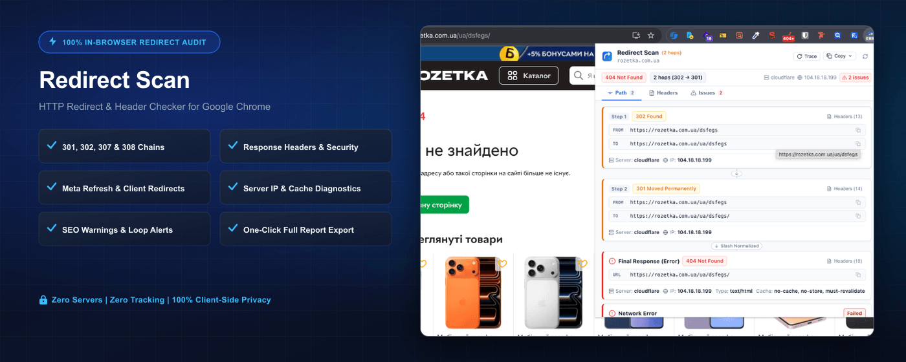
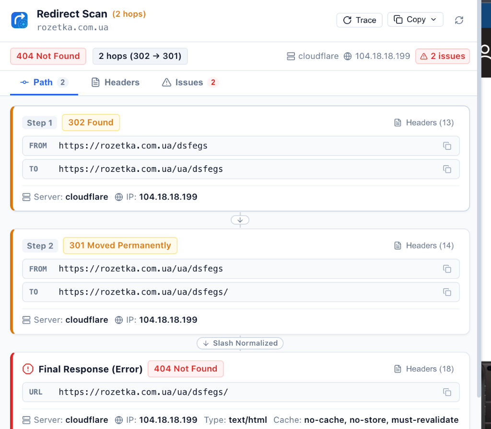
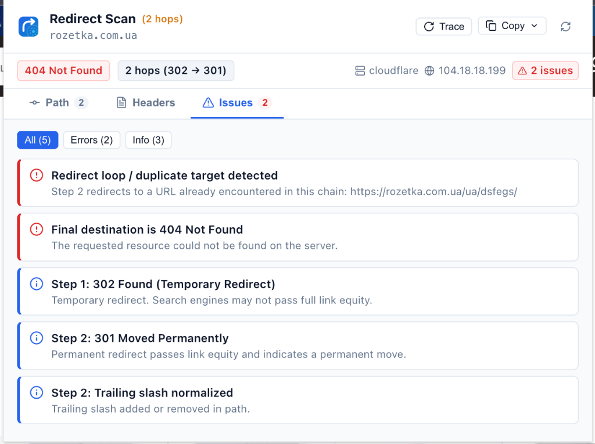

# Redirect Scan

<div align="center">

[](https://chrome.google.com/webstore)
[](https://developer.chrome.com/docs/extensions/mv3/intro/)
[](https://react.dev/)
[](https://vitejs.dev/)
[](LICENSE)
[](#-privacy--security)

---

### Fast, lightweight, and 100% private in-browser Chrome extension for inspecting HTTP redirect chains, status codes, response headers, and client-side redirects.

</div>

<br />



<br />

---

## 🚀 Key Highlights

- ⚡ **Complete HTTP Redirect Chain Capture**: Observes real-time top-level navigations before the popup is even opened, capturing `301`, `302`, `303`, `307`, and `308` redirect hops.
- 🎯 **Final Response & Error Diagnostics**: Instant detection of `200 OK`, `4xx` client errors (`404 Not Found`, `410 Gone`, `429 Too Many Requests`), `5xx` server errors (`500`, `502`, `503`, `504`), and browser network errors (`ERR_TOO_MANY_REDIRECTS`, `ERR_NAME_NOT_RESOLVED`).
- 🔄 **Client-Side Redirect & Meta Refresh Tracking**: Early DOM scanning at `document_start` + `MutationObserver` to identify `<meta http-equiv="refresh">` tags (with delay and destination) and `webNavigation` client-side transitions.
- 📑 **Grouped HTTP Response Headers**: Structured breakdown into **SEO / Crawling** (`Location`, `X-Robots-Tag`, `Link`, `Canonical`), **Caching** (`Cache-Control`, `Expires`, `ETag`, `Age`, `CF-Cache-Status`), **Security** (`HSTS`, `CSP`, `X-Frame-Options`), and **Server** (`Server`, `IP`, `From Cache`), plus full search across all headers.
- 🌐 **Server IP & Caching Diagnostics**: Displays actual server IP addresses and cached status (`fromCache`) as provided directly by Chrome.
- 🛡️ **Intelligent SEO & Technical Rules Engine**:
  - ⚠️ Long redirect chain alerts ($\ge 3$ hops)
  - 🚨 Redirect loop detection ($A \rightarrow B \rightarrow A$ and browser loop errors)
  - 🔒 Protocol checks (HTTP $\rightarrow$ HTTPS security upgrade vs. HTTPS $\rightarrow$ HTTP insecure downgrade)
  - 🌍 Domain migrations (Cross-domain redirects)
  - 🏷️ Stripped or lost URL query parameters (e.g. `utm_*` marketing tags)
  - 🔀 Canonical hostname (`www`) adjustments and trailing slash normalizations
- 🏷️ **Dynamic Toolbar Badge**: Real-time toolbar icon badge indicating first redirect code (`301`), error status (`404`, `500`), client redirect (`CR`), or clearing automatically on clean `200 OK` pages.
- 📋 **One-Click Export Tools**: Fast copy for individual URLs, concise plaintext redirect paths, and comprehensive technical audit reports formatted for Slack, Notion, Jira, or GitHub issues.
- 🔄 **Reload & Trace**: One-click hard reload bypassing browser cache to capture and trace the entire redirect lifecycle from the initial request.
- 🛡️ **100% Private & Zero-Server**: Runs entirely inside your browser with **Zero External APIs**, **Zero Telemetry**, **Zero History Retention**, and **Zero Cookie/Auth Collection**.

---

## 📂 Feature & Diagnostic Matrix

| Module / Feature | Inspected Signals | Checks & Heuristics |
| :--- | :--- | :--- |
| **HTTP Redirects (3xx)** | `301`, `302`, `303`, `307`, `308` | Full chain order, multi-hop latency warning, multiple temporary redirects warning. |
| **Final HTTP Status** | `200`, `4xx`, `5xx`, Status Line | `200 OK` confirmation, `404 Not Found`, `410 Gone`, `429 Rate Limit`, `500/502/503/504` errors. |
| **Client Redirects** | `<meta http-equiv="refresh">`, `client_redirect` | Meta Refresh delay & destination, client-side transition evidence, deduplication. |
| **Protocol Transitions** | `http:` vs `https:` schemes | HTTP $\rightarrow$ HTTPS (Passed/Secure), HTTPS $\rightarrow$ HTTP (Security Warning). |
| **Domain & Host** | `from.hostname` vs `to.hostname` | Cross-domain redirect detection, canonical `www` prefix additions / removals. |
| **Path & Query Params** | `pathname`, `searchParams` | Trailing slash normalization, stripped query parameters (e.g. `utm_*`, tracking IDs). |
| **Loops & Excessive Hops** | Visited URLs set, `ERR_TOO_MANY_REDIRECTS` | Circular loop detection ($A \rightarrow B \rightarrow A$), long chain warning ($\ge 3$ redirects). |
| **Response Headers** | `responseHeaders` (Case-insensitive) | Categorized into SEO, Caching, Security, Server, and All Headers with real-time search. |
| **Server & Connection** | `details.ip`, `fromCache`, `Server` | Server IP display (IPv4/IPv6), cache hit indicator, web server software identification. |

---

## 📸 Screenshots & Visual Overview

<div align="center">
  <table>
    <tr>
      <td align="center" width="50%">
        <strong>Redirect Waterfall & Path Trace</strong><br /><br />
        
      </td>
      <td align="center" width="50%">
        <strong>Technical & SEO Issues Tab</strong><br /><br />
        
      </td>
    </tr>
  </table>
</div>

---

## 🏗️ Architecture & Project Structure

```text
redirect-scan/
├── public/
│   ├── manifest.json              # Chrome Extension Manifest V3
│   └── icons/                     # Vector-generated icons (16, 32, 48, 128)
│
├── src/
│   ├── background/
│   │   ├── service-worker.js      # SW entry point (top-level event registration)
│   │   ├── registerWebRequest.js  # main_frame webRequest listeners
│   │   ├── registerWebNavigation.js # Navigation transition & qualifier listeners
│   │   ├── registerTabs.js        # Tab lifecycle & automatic cleanup
│   │   ├── registerMessages.js    # Runtime messaging handler
│   │   └── badgeController.js     # Toolbar badge text & color controller
│   │
│   ├── tracking/
│   │   ├── navigationTracker.js   # Navigation lifecycle & chain continuation
│   │   ├── chainBuilder.js        # Step aggregator & state builder
│   │   ├── clientRedirectTracker.js # Meta Refresh & client_redirect correlation
│   │   └── redirectMatcher.js     # Hop correlation & fuzzy URL matching
│   │
│   ├── storage/
│   │   └── tabRedirectStore.js    # In-memory cache + chrome.storage.session
│   │
│   ├── content/
│   │   ├── meta-refresh-detector.js # Self-contained document_start content script
│   │   └── parseMetaRefresh.js    # Meta Refresh content parser
│   │
│   ├── rules/
│   │   ├── redirectRulesEngine.js # Rules orchestrator & severity sorter
│   │   ├── statusRules.js         # HTTP status code heuristics
│   │   ├── chainRules.js          # Chain length & loop detection
│   │   ├── protocolRules.js       # Protocol upgrade/downgrade checks
│   │   └── urlRules.js            # URL transform & query stripping rules
│   │
│   ├── popup/
│   │   ├── App.jsx                # Root popup UI
│   │   ├── popup.css              # Pro Developer Tools Light Theme design system
│   │   ├── components/            # Header, Summary, Tabs, Cards, Badges, Toast
│   │   ├── sections/              # PathSection, HeadersSection, IssuesSection
│   │   ├── hooks/                 # useTabRedirectState, useClipboard
│   │   └── utils/                 # reportFormatter, headerUtils, urlUtils
│   │
│   └── shared/
│       ├── constants.js           # Shared constants & badge colors
│       ├── statusCodes.js         # HTTP status codes & descriptions dictionary
│       ├── headerUtils.js         # Case-insensitive header grouping
│       └── urlUtils.js            # URL comparison & formatting helpers
│
├── dev-server/
│   └── server.js                  # Local Node.js test server with 18+ scenarios
│
├── tests/                         # Vitest + Testing Library unit test suite
├── store/                         # Chrome Web Store submission assets & descriptions
│   ├── assets/
│   │   └── promo_marquee_1400x560.png # Promo Marquee Banner
│   ├── store_listing.md           # All-in-one store listing kit
│   ├── description.md             # Detailed store description
│   ├── privacy.md                 # Privacy policy
│   └── permissions.md             # Permissions justification
└── scripts/                       # Packaging, icon and banner generation scripts
```

---

## 🛠️ Development & Testing

### 1. Install Dependencies
```bash
npm install
```

### 2. Run Automated Test Suite
```bash
npm test
```
*(Runs 40+ unit and component tests covering chain building, rules engine, header grouping, Meta Refresh parsing, badge controller, and UI components).*

### 3. Launch Local Test Server
```bash
npm run test:server
```
Runs a local Node.js test server on `http://localhost:3000` with preconfigured test scenarios:
- **3xx Redirects**: `/301-to-200`, `/302-to-200`, `/301-302-200`, `/303`, `/307`, `/308`
- **Error Codes**: `/404`, `/410`, `/429`, `/500`, `/502`, `/503`, `/504`
- **Client Redirects**: `/meta-refresh`, `/js-redirect`
- **Loops & Headers**: `/redirect-loop-a`, `/headers`

### 4. Build Production Bundle
```bash
npm run build
```
Compiles production assets into `dist/`.

### 5. Create Distribution ZIP Archive
```bash
npm run package
```
Generates `release/redirect-scan-v1.0.0.zip` ready for Chrome Web Store upload.

---

## 📥 Loading in Google Chrome

1. Navigate to `chrome://extensions/` in Google Chrome.
2. Toggle on **Developer mode** in the upper-right corner.
3. Click **Load unpacked** and select the [`dist/`](dist/) folder.
4. Open any website or `http://localhost:3000` to inspect live redirect paths!

---

## 🔒 Privacy & Security

* **Local Processing Only**: Redirect Scan operates 100% on the client side. No data is ever transmitted to remote servers.
* **Top-Level Navigation Only**: Only `main_frame` documents are inspected. Background subresources (images, scripts, styles, tracking pixels, iframes) are never captured.
* **No Request Cookies or Authorization Headers**: Sensitive authentication credentials and cookies are excluded.
* **Ephemeral Session Storage**: Redirect state is kept temporarily in `chrome.storage.session` and memory. It is automatically discarded when a tab is closed or Chrome is restarted.

---

## 📄 License

This project is licensed under the [MIT License](LICENSE).
